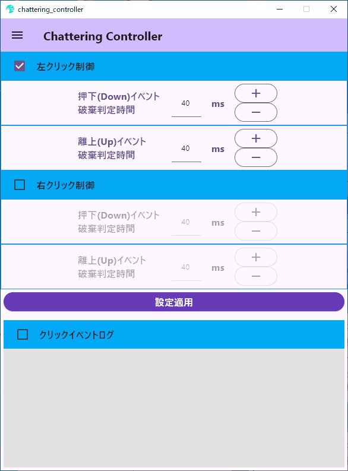
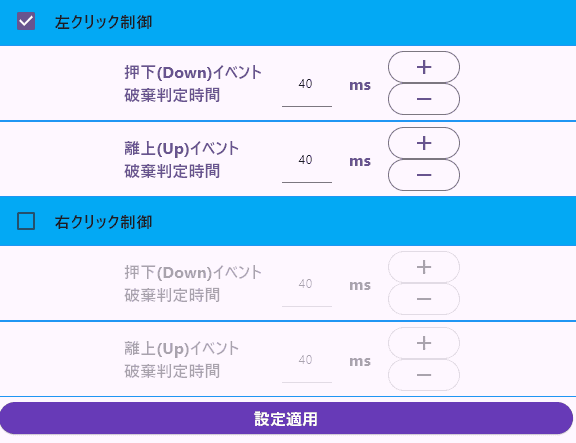

# chattering_controller

<code style="color:red;font-weight:bold;">(Translated from Japanese to English using Google Translate. Sorry if I'm wrong.)</code>

  

<!--
画像の表示方法について、
画像アップローダー等を利用して画像ファイルの置き場所を
1箇所にまとめるのが基本的な手法ですが、
私は画像を表示させるだけでデータ通信が発生する挙動は好ましくないと考えています。

しかし、ローカルから画像を読み込む場合だと
プログラムファイルと画像フォルダの置き場所、フォルダ階層構造の工夫が必要となる。

例えばassetに画像ファイルをまとめると、
普通に表示する場合とプログラムから表示する場合とでファイルのパスが異なってしまう。

そこで、pictureタグを使って、通常の表示用とプログラム上の表示用、両方の画像パス指定を行う。

仕組みとしては、

プログラム上での表示にはimgタグ単体でassetの画像を指定する。
なお、imgタグ単体のasset画像はブラウザ表示では画像無し枠が出てしまうので、
altで空白スペース1文字に置き換わるようにしておく。

通常の表示にはpictureタグで、sourceタグは使用せずにimgタグで画像を表示する。

flutter_htmlパッケージは24/10現在、
pictureタグ未対応のようなのでプログラム上では何も表示されず、
imgタグ単体のasset画像は表示される。

※通常の使用方法と異なるので、flutter_htmlの更新で使えなくなる可能性あり
-->

<picture>

</picture>

Controls mouse chattering.

 

マウスのチャタリングを制御します。

 

---
# What is chattering?

A phenomenon in which one mouse click becomes two or more clicks, or a drag operation is interrupted midway.

 

マウスの1回のクリックが2回以上のクリックになったり、ドラッグ操作が途中で中断されたりする現象。

 

---
# Features

1. Chatter detection can be adjusted independently for "UP" and "DOWN" mouse click events.

1. Since it starts with administrator privileges, 
it also supports mouse operations during game play 
and mouse operations in other applications started with administrator privileges.

1. Mouse drag operations are not supported.

 

1. チャタリング検出は、"UP" と "DOWN" のマウスクリックイベントに対して個別に調整できます。

1. 管理者権限で起動するため、 
ゲームプレイ中のマウス操作や、 
管理者権限で起動した他のアプリケーションでのマウス操作にも対応します。

1. マウスのドラッグ操作には対応していません。

 

---
# Operation confirmation/development environment

<table>
<tr>
<th>development language</th>
<th>version</th>
</tr>
<tr>
<td>Flutter (Dart)</td>
<td>3.24.3 (3.5.3)</td>
</tr>
</table>

 

<table>
<tr>
<th>development environment (OS)</th>
<th>version</th>
</tr>
<tr>
<td>Windows 10 Home 64bit</td>
<td>22H2</td>
</tr>
</table>

It may not work as expected in other OS environments. 
For example, it won't work on 32-bit OS.

 

他のOS環境では期待どおりに動作しない可能性があります。 
たとえば、32 ビット OS では動作しません。

 

---
# Usage

<picture>

</picture>

Select the checkbox and press the "設定適用" button to start controlling the corresponding click event. 
The value below the checkbox indicates that if the same event occurs consecutively within milliseconds, 
it is considered chattering and the event is discarded.

 

チェックボックスを選択して "設定適用" ボタンを押すと、対応するクリックイベントの制御が開始されます。 
チェックボックスの下の値は、同じイベントがミリ秒以内に連続して発生した場合、 
これはチャタリングとみなされ、イベントは破棄されます。

 

---
# Reason for production

1. Chattering occurs frequently in my PC environment. 
The environment also makes it difficult to take measures such as cleaning the mouse, removing static electricity, and replacing it with a new mouse.

1. There is software to solve chattering, but it did not work as expected in my PC environment.

1. On a different note, I was looking for a good theme to practice Flutter development. 
I thought that solving chattering would be a good theme to practice Flutter development on Windows OS.

1. I decided to write software that works as expected in my PC environment.

 

1. 私の PC 環境ではチャタリングが頻繁に発生します。 
また、マウスの清掃や静電気の除去、新しいマウスへの交換などの対策がとりにくい環境でもあります。

1. チャタリングを解決するソフトウェアはありますが、私の PC 環境では思うように動作しませんでした。

1. 話は変わりますが、Flutter 開発の練習に良いテーマを探していました。 
チャタリングの解決は Windows OS 上での Flutter 開発を実践するのに良いテーマだと思いました。

1. 私の PC 環境で期待どおりに動作するソフトウェアを作成することにしました。

 

---
# Note

"chattering_controller" is software developed as an exercise in Flutter development. 
Also, since it was created exclusively for me, it may be difficult to use. 

for example,
* Most are written in Japanese.
* Memory consumption is high.
* Poor UI design sense (probably).

and so on

 

"chattering_controller" は、Flutter 開発の演習として開発されたソフトウェアです。 
また、私専用に作成したものなので、使いにくいかもしれません。 

例えば、
* ほとんどが日本語で書かれています。
* メモリ消費量が多い。
* UIデザインのセンスが悪い（たぶん）。

等々

 

---
# Software development period

I'm writing this as an indicator of my development ability (at the time).

<table>
<tr>
<th>work item</th>
<th>period</th>
</tr>
<tr>
<td>Study</td>
<td>About 2 and a half months (about 50 days)</td>
</tr>
<tr>
<td>Software development</td>
<td>About 1 month (about 20 days)</td>
</tr>
<tr>
<td>Operation confirmation</td>
<td>About 2 month (about 40 days)</td>
</tr>
</table>
<code style="color:red;font-weight:bold;">*Man-hours (hours per day) = approximately 6 hours</code>
 

 

The purpose of this software development was to learn the Dart language from the basics and become familiar with Flutter development. 
I aimed for a quality that wouldn't be embarrassing to publish, but I have no confidence in my UI design sense at all. 
The operation verification period was long because trial and error was repeated until a satisfactory result was obtained. 

 

私の開発能力（当時）の指標としてこれを書いています。

<table>
<tr>
<th>作業項目</th>
<th>期間</th>
</tr>
<tr>
<td>学習</td>
<td>約2ヶ月半(50日ぐらい)</td>
</tr>
<tr>
<td>ソフトウェア開発</td>
<td>約1ヶ月(20日ぐらい)</td>
</tr>
<tr>
<td>動作確認</td>
<td>約2ヶ月(40日ぐらい)</td>
</tr>
</table>
<code style="color:red;font-weight:bold;">※工数（1日あたりの時間）＝約6時間</code>
 

 

このソフトウェア開発の目的は、Dart 言語を基礎から学び、Flutter 開発に慣れることでした。 
公開しても恥ずかしくないクオリティを目指しましたが、UIデザインのセンスには全く自信がありません。 
満足のいく結果が得られるまで試行錯誤を繰り返したため、動作確認期間が長くなりました。 

 

---
# Author

* yoki
* [Contact Form](https://yoki2.com/contact/)
* [X(Twitter)](https://x.com/yoki2programmer)

 

---
# License

"chattering_controller" is under [MIT license](https://en.wikipedia.org/wiki/MIT_License).

 

---
Thank you for reading to the end.

最後まで読んでいただきありがとうございます。
